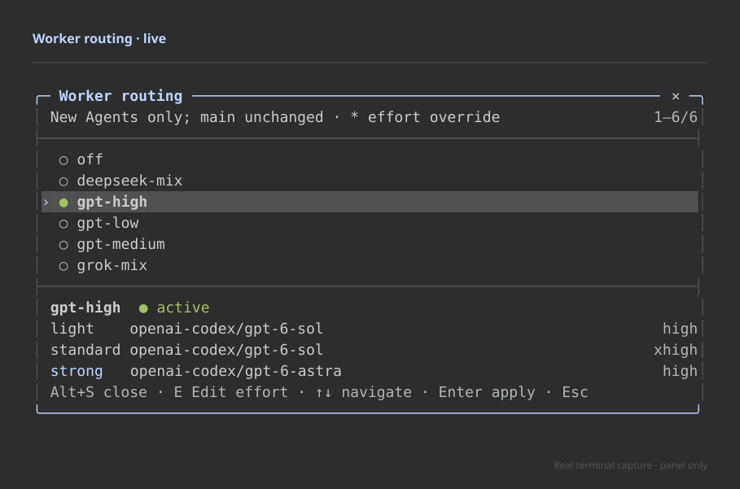
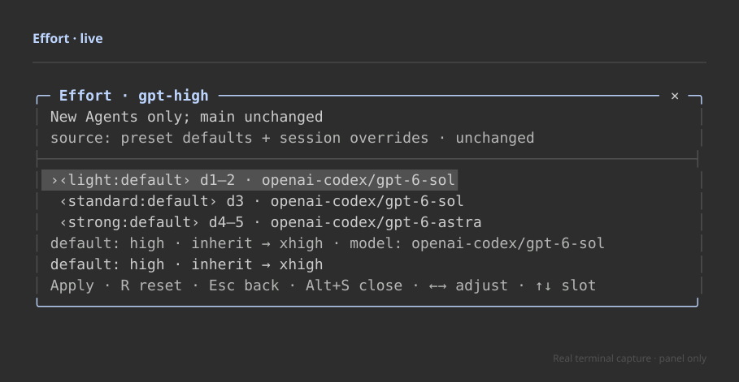
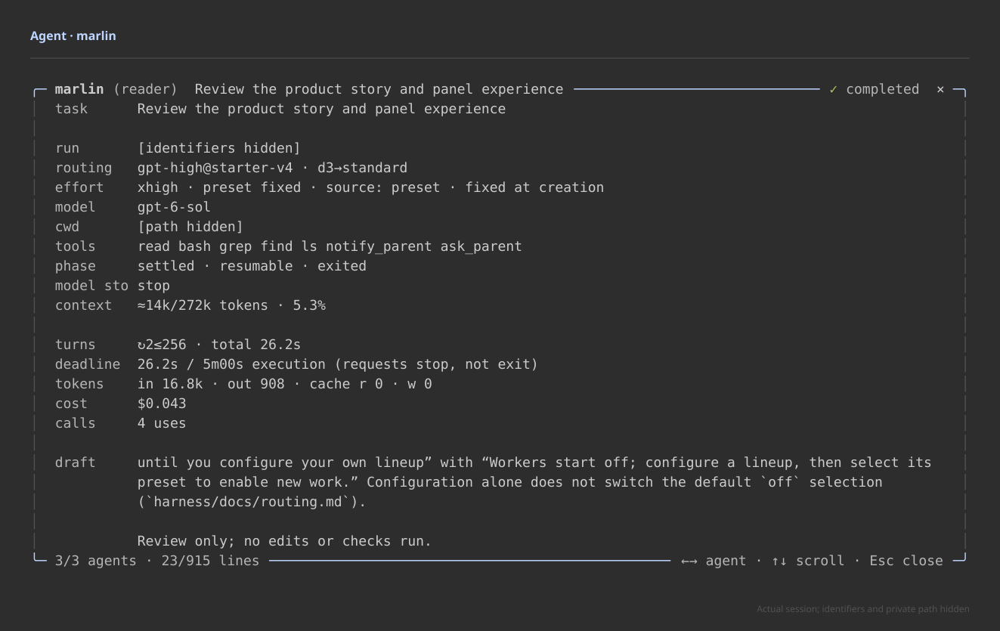
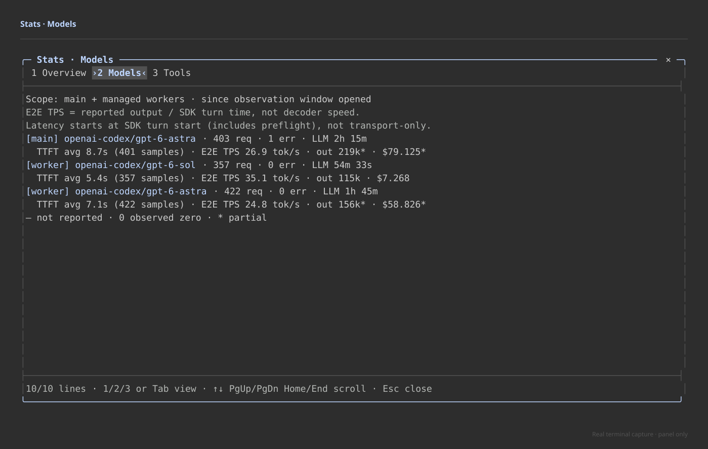

# Pi Alehouse

**One conversation. A whole crew.**

Pi Alehouse turns Pi into a multi-agent workspace. Bring in help, keep useful agents around, and see what everyone is doing—without leaving your main conversation.

The point isn't to spawn more agents. It's to make a team of them worth working with.

## Give the task a difficulty, not a model name

Your main agent assesses how hard a task is. **You decide which models and how much thinking those tasks get.**

Worker presets map lighter work, everyday reasoning, and the hard problems to your choice of models—even across providers. Thinking effort is a separate control. A quick lookup and a difficult design decision don't have to get the same treatment, and neither has to use your main model.

Set up your lineups once; select a preset and tune its thinking effort from the panel, not a pile of prompts. New agents take the new settings; agents already working keep theirs.

*The author's live setup, not a suggested default.*

## Keep the teammate, not just the answer

An agent isn't a disposable task. Within your session, it keeps its conversation between assignments.

Send it a follow-up. Redirect work while it's running. Let it ask a question when something is unclear. Reuse the agent that already knows the problem instead of starting another one from scratch.

There is no mandatory research → plan → code → review ritual. Your main agent can work directly, delegate independent pieces, or return to an existing teammate. **Parallel when it helps. Continuity when it matters.**

## See the work—not just the final summary

Parallel work shouldn't disappear behind a spinner.

The agent panel puts names, current tasks, live tool activity, context usage and reported cost together. Open an agent to follow its actual conversation: thinking, tool calls, output and streaming replies. Read back without losing the live tail, then return to the main conversation without losing what you were typing.

*An actual agent reviewing this README. Only its identifiers and private path are hidden.*

The rest of the interface follows the same idea:

| Panel | What it puts in your hands |
| --- | --- |
| **Agents** | Who's working, what they're doing, and who needs an answer. |
| **Routing & effort** | Your worker lineup and how much thinking each kind of task gets. |
| **Usage** | Reported usage across the main conversation and worker models. |
| **Stats** | Activity, waiting, model timings and tool activity—not just a token counter. |
| **Approvals** | Permission choices in the same workspace; inspection panes step aside when a decision needs your attention. |

*Reported activity from the same working session.*

These aren't separate dashboards to babysit. They belong to the conversation you're already in.

## Try it

Alehouse uses your existing Pi installation and provider setup. Start it with `pi-alehouse`; ordinary `pi` stays ordinary Pi.

**Early preview · Linux · MIT.** Available from source; not yet published to npm. Fresh setups start with workers off: configure a lineup, then select its preset to bring them in.

**[Get started](harness/docs/getting-started.md)** · [Panel guide](harness/docs/interface.md) · [Configure your crew](harness/docs/routing.md) · [Support & limits](harness/docs/limitations.md)

For contributors: [development](harness/docs/development.md), [architecture](harness/docs/architecture.md), [security](harness/docs/security.md), and [validation](harness/docs/validation-evidence.md).

---

Created by **Yang Li**. [MIT license](LICENSE) · [Third-party notices](THIRD_PARTY_NOTICES.md).
